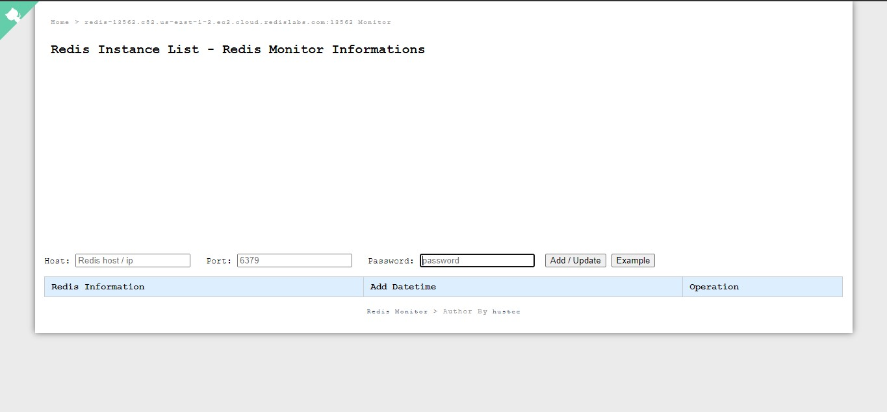

# redis-monitor
Nodejs/Express based Redis monitor
<h1>Redis-Monitor in Nodejs/Express</h1>
<h2>Tech Stack</h2>
<ul>
  <li>Nodejs</li>
  <li>Express</li>
  <li>Sqlite</li>
  <li>Sequelize</li>
</ul>  

<b>Note:</b>All other dependencies can be viewed in Package.JSON

<h1>How to run this Project</h1>
<h3>Project is hosted on heroku and can be accessed on <a href="https://redis-monitor-kritikal.herokuapp.com/">this </a>link</h3>

<b>Note:</b>You can create your own redis server at <a href ="https://redislabs.com/" >Redis Labs </a> 

For testing purpose following can be used(just copy and paste them) :

<ul>
  <li>host : redis-13562.c82.us-east-1-2.ec2.cloud.redislabs.com </li>
  <li>port : 13562 </li>
  <li>password : 1aqldeP6LgQWUaNjSqSV6JxDi5Jbgpr5 </li>
</ul>  

<h3>To access project locally. Follow the following steps </h3>

<b>Note</b>Nodejs version 4 or above , npm and Redis must be installed on the computer

<ol>
  <li>Clone this repository</li>
  <li>In terminal: npm install </li>
  <li>npm start</li>
  <li>In the browser go to the following URL : 127.0.0.1:1234 </li>
</ol>

<h2>Following API has been used on the Backend side </h2>
<ol>
  <li>GET: /api/redis_list</li>
  <li>GET: /api/redis_info</li>
  <li>GET: /api/ping</li>
  <li>GET: /api/redis_monitort</li>
  <li>GET: /api/redis/flushall</li>
  <li>POST: /api/add</li>
  <li>POST: /api/del</li>
</ol>  

<h2>Screenshots</h2>

